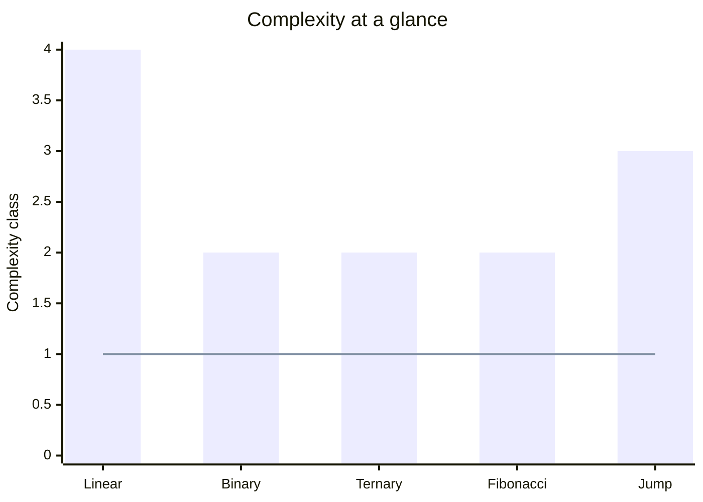

# Complexity

Visual comparison of all 5 searching algorithms in retrievium.

**Scale** — Big-O classes mapped to an ordinal axis:

| Value | Complexity |
|---|---|
| 1 | O(1) |
| 2 | O(log n) |
| 3 | O(√n) |
| 4 | O(n) |

> **Bar** — Time &nbsp;|&nbsp; **Line** — Space
